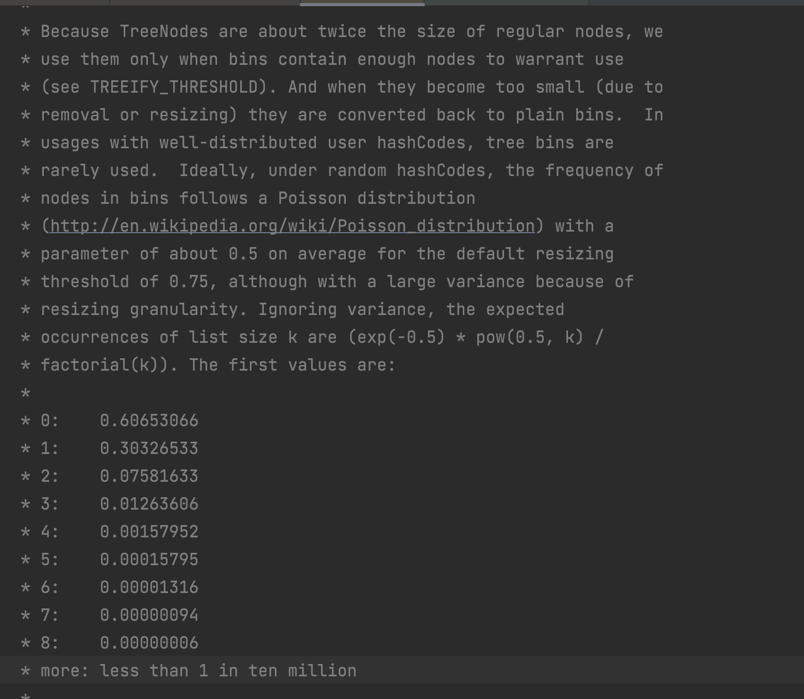

# 1、HashMap能否存储key为null或value为null的值?
```java
// 首先对key进行hash的方法
static final int hash(Object key) {
        int h;
        // 如果key为null，对应的hash值为0，允许为null
        return (key == null) ? 0 : (h = key.hashCode()) ^ (h >>> 16);
}
// 具体的存储数据方法putVal
final V putVal(int hash, K key, V value, boolean onlyIfAbsent,
        boolean evict){
        Node<K, V>[]tab;Node<K, V> p;int n,i;
        if((tab=table)==null||(n=tab.length)==0)
            n=(tab=resize()).length;
        if((p=tab[i=(n-1)&hash])==null)
            // 直接创建Node节点
            tab[i]=newNode(hash,key,value,null);
}
```
> 总结：hashMap允许key和value都为null的情况,当key为null时，对应的hash值为0
# 2、为什么在1.8hashMap的某个链表超过8时，转化为红黑数

> 从代码注释中可以看出，因为hashMap本身就会进行扩容，在负载因子在0.75情况下，一个链表中的节点超过8个概率
> 基本在千万分之一，已经是一个极小的概率，而转化成树就是为了防止极端情况下的性能降低，基本上到8就可以转化为树
# 3、为什么hashMap每次扩容为原来的2倍?
```java
// 在putVal和扩容时，都需要计算元素落在那个位置
// 使用的方法是（map大小 - 1） & hash比较 比如16 - 1 = 15，在二进制中表示为1111，在二进制为&运算时，二进制是1还是0由传入的hash值来决定
// 可以减少hash碰撞的概率
final V putVal(int hash, K key, V value, boolean onlyIfAbsent,
                   boolean evict){
        Node<K, V>[]tab;Node<K, V> p;int n,i;
        if((tab=table)==null||(n=tab.length)==0)
            n=(tab=resize()).length;
        if((p=tab[i=(n-1)&hash])==null)
            tab[i]=newNode(hash,key,value,null);
    }

```
> 总结：扩容为2倍就是为了在计算元素落在那个桶的位置时，减少hash碰撞。
# 4、通过new Hash(10)进行创建hashMap时，容量为多少？
```java
 public HashMap(int initialCapacity, float loadFactor) {
        if (initialCapacity < 0)
            throw new IllegalArgumentException("Illegal initial capacity: " +
                                               initialCapacity);
        if (initialCapacity > MAXIMUM_CAPACITY)
            initialCapacity = MAXIMUM_CAPACITY;
        if (loadFactor <= 0 || Float.isNaN(loadFactor))
            throw new IllegalArgumentException("Illegal load factor: " +
                                               loadFactor);
        this.loadFactor = loadFactor;
        this.threshold = tableSizeFor(initialCapacity);
 }
 
 // 当传入的cap不是2的倍数时，计算得到最解决传入值2的倍树的值
static final int tableSizeFor(int cap) {
        int n = cap - 1;
        n |= n >>> 1;
        n |= n >>> 2;
        n |= n >>> 4;
        n |= n >>> 8;
        n |= n >>> 16;
        return (n < 0) ? 1 : (n >= MAXIMUM_CAPACITY) ? MAXIMUM_CAPACITY : n + 1;
}

```
> 总结：不论传入的值是啥，都会转化为最接近这个值的2的倍数，如传入10，那么大小为16
> 传入30那么大小为32？为什么这么做呢？和扩容一样就是为了在插入元素时，减少hash碰撞的概率。
